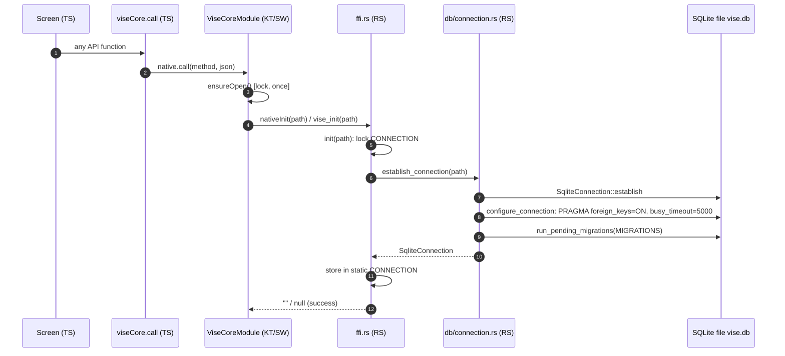
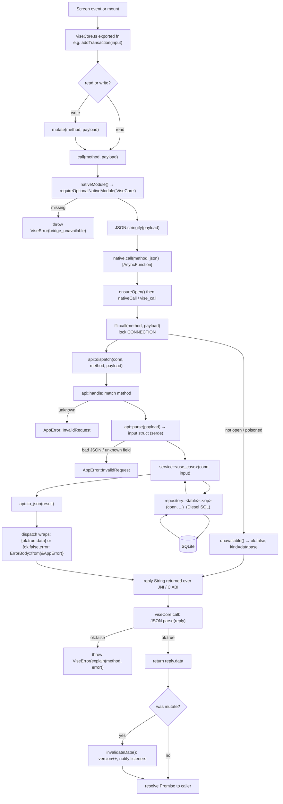
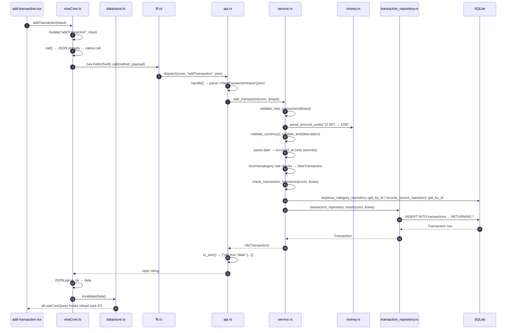
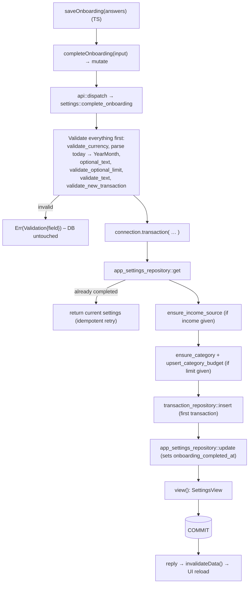
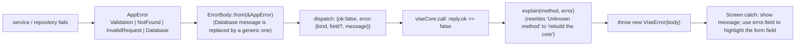
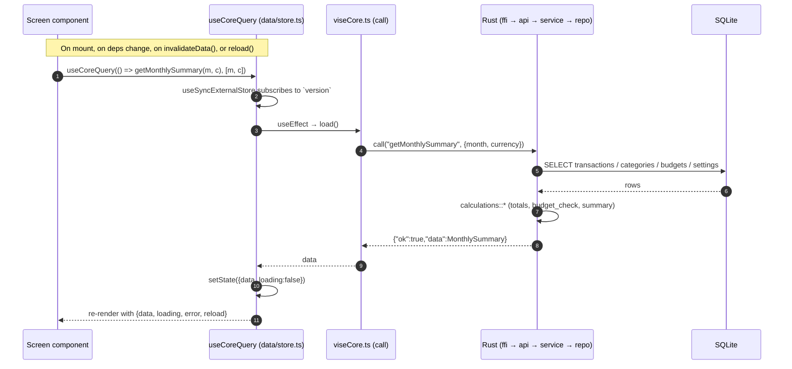
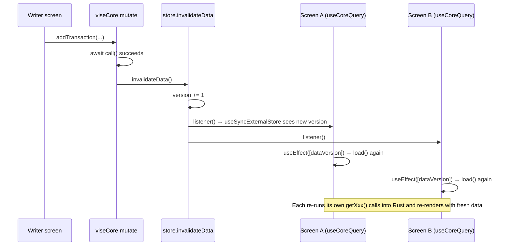

# Function trace: frontend → Rust → SQLite → UI

A function-by-function chart of every step a call takes. Companion to
[FRONTEND_RUST_BRIDGE.md](FRONTEND_RUST_BRIDGE.md) (the architecture) and
[PERSISTENCE.md](PERSISTENCE.md) (the guarantees). Diagrams are Mermaid; they render on GitHub and in VS Code's Markdown preview.

Legend: **TS** = TypeScript, **KT** = Kotlin, **SW** = Swift, **RS** = Rust.

---

## 1. App start: opening the database

The database is opened lazily, on the first call.

| # | Function | File | What it does |
|---|---|---|---|
| 1 | `ensureOpen()` | `ViseCoreModule.kt` / `.swift` | Builds the path (`filesDir/vise.db` or `Application Support/vise.db`); runs once per process |
| 2 | `nativeInit` / `vise_init` | `ffi.rs` | JNI / C wrapper; converts the path to a Rust `String` (`read` / `c_str`) |
| 3 | `init(path)` | `ffi.rs` | Locks `CONNECTION`; opens only if still `None` |
| 4 | `establish_connection` | `db/connection.rs` | Opens the file, applies pragmas, runs embedded migrations (`migrations/*`) |
| 5 | `configure_connection` | `db/connection.rs` | Enables foreign keys and a 5 s busy timeout |

---

## 2. Master flow: one call, end to end

Every API call, read or write, passes through these same functions.

---

## 3. Write flow: `addTransaction`

Frontend sends `{transaction_type, amount:"12.50", currency, description, date, expense_category_id?}`.

| Layer | Function | Input → output |
|---|---|---|
| TS | `addTransaction` → `mutate` → `call` | `NewTransactionInput` → JSON string |
| KT/SW | `AsyncFunction("call")` | forwards strings |
| RS ffi | `ffi::call` | locks connection, forwards |
| RS api | `dispatch` → `handle` → `parse` | JSON → `NewTransactionInput` |
| RS service | `add_transaction` | orchestrates below |
| RS service | `validate_new_transaction` | raw strings → `NewTransaction` (cents, unix time) or `AppError::Validation{field}` |
| RS money | `parse_amount_cents` | `"12.50"` → `1250` |
| RS service | `check_transaction_references` | confirms category / source IDs exist |
| RS repo | `transaction_repository::insert` | `INSERT ... RETURNING` → `Transaction` |
| RS api | `to_json` + `dispatch` | `Transaction` → `{"ok":true,"data":...}` |
| TS | `invalidateData` | triggers UI reload |

---

## 4. Per-method function map

Each row: the function chain after `api::handle` picks the method. All chains start at `viseCore.ts` →
`ffi::call` → `api::dispatch`; only the unique part is shown.
`R` = read (`call`), `W` = write (`mutate`, triggers UI refresh).

### Transactions

| TS function | R/W | Method | Service fn | Validation / calc helpers | Repository fn(s) | SQL |
|---|---|---|---|---|---|---|
| `addTransaction` | W | `addTransaction` | `add_transaction` | `validate_new_transaction`, `parse_amount_cents`, `check_transaction_references` | `transaction_repository::insert` | INSERT … RETURNING |
| `updateTransaction` | W | `updateTransaction` | `update_transaction` | same as above | `transaction_repository::update` | UPDATE … `updated_at=unixepoch()` RETURNING |
| `deleteTransaction` | W | `deleteTransaction` | `delete_transaction` | n/a (NotFound if 0 rows) | `transaction_repository::delete` | DELETE WHERE id |
| `listTransactions` | R | `listTransactions` | `list_transactions` | `validate_month`, `YearMonth::start_timestamp/end_timestamp` | `transaction_repository::get_in_range` | SELECT by `occurred_at` range, newest first |

### Categories & income sources

| TS function | R/W | Service fn | Helpers | Repository fn(s) |
|---|---|---|---|---|
| `listCategories` | R | `list_categories` | n/a | `expense_category_repository::get_all` |
| `addCategory` | W | `add_category` | `validate_text`, `validate_color`, `duplicate_name_error` | `expense_category_repository::insert` |
| `listIncomeSources` | R | `list_income_sources` | n/a | `income_source_repository::get_all` |
| `addIncomeSource` | W | `add_income_source` | `validate_text`, `duplicate_name_error` | `income_source_repository::insert` |

### Budgets

| TS function | R/W | Service fn | Helpers | Repository fn(s) |
|---|---|---|---|---|
| `setMonthBudget` | W | `set_month_budget` | `validate_month`, `validate_currency`, `validate_optional_limit`, `get_or_create_budget_month` | `budget_month_repository::get_by_month` / `insert` / `update` |
| `setCategoryBudget` | W | `set_category_budget` → `upsert_category_budget` | `validate_month`, `validate_currency`, `parse_limit_cents` | `get_or_create_budget_month` repos + `category_budget_repository::upsert` |
| `deleteCategoryBudget` | W | `delete_category_budget` | n/a | `category_budget_repository::delete_for_category` |

### Settings & onboarding

| TS function | R/W | Service fn | Notes |
|---|---|---|---|
| `getSettings` | R | `settings::get_settings` → `view` | `app_settings_repository::get`, plus `income_source_repository::get_by_id` for the source name |
| `updateSettings` | W | `settings::update_settings` | Validates each provided field; `app_settings_repository::update`; returns `view` |
| `completeOnboarding` | W | `settings::complete_onboarding` | **One DB transaction.** See §5 |

### Data management

| TS function | R/W | Service fn | Notes |
|---|---|---|---|
| `getDataOverview` | R | `data::get_data_overview` | `COUNT(*)` on transactions, categories, income sources, budgets |
| `exportDataCsv` | R | `data::export_csv` | Loads categories, sources, all transactions; builds CSV with the `csv` crate; returns the text, writes no file |
| `deleteAllData` | W | `data::delete_all_data` | Requires `confirm:"DELETE"`; **one DB transaction**, then `VACUUM` |

### Reports (read-only, computed in Rust)

| TS function | Service fn | Reads (repository) | Pure calculations (`calculations/`) |
|---|---|---|---|
| `getMonthlySummary` | `get_monthly_summary` | `transaction_repository::get_in_range`, `expense_category_repository::get_all`, `budget_month_repository::get_by_month`, `category_budget_repository::get_for_budget_month`, `app_settings_repository::get` | `totals::month_totals` → `budget_check::check_categories` (uses `compare_to_limit`) → `summary::build_summary` → `summary::apply_expected_income` |
| `getCategoryBreakdown` | `get_category_breakdown` | via `get_monthly_summary` | `analytics::category_breakdown` |
| `getSpendingTrend` | `get_spending_trend` | `transaction_repository::get_in_range` (whole window, one query) | `totals::spending_by_month` → `analytics::spending_trend` |
| `predictSpending` | `predict_spending` | `transaction_repository::get_in_range` (lookback window) | `totals::spending_by_month` → `analytics::spending_trend` → `predictions::predict_next` |

---

## 5. Atomic multi-step writes

Two methods change many tables in a single SQLite transaction (`connection.transaction`), so a failure
part-way leaves nothing behind.

### `completeOnboarding`

### `deleteAllData`

`delete_all_data` checks `confirm == "DELETE"`, then inside one transaction deletes (children first):
transactions → category budgets → month budgets → auto category rules → sync state → revolut accounts,
resets the `app_settings` row (id 1), then deletes categories and income sources. After commit it
runs `VACUUM` so deleted rows leave the file. Returns `DeletedCounts`.

---

## 6. Error path

For writes, `invalidateData()` is **not** called on failure, so the UI is not refreshed by a failed save.

---

## 7. Read flow: how data is published to the UI

Rust never pushes to the UI. The UI **pulls**, and `invalidateData()` tells every mounted screen to pull again.

### After a write: the refresh loop

| Function | File | Role in publishing to the UI |
|---|---|---|
| `invalidateData()` | `src/data/store.ts` | Bumps the global `version`, calls every listener |
| `subscribeToInvalidation()` | `src/data/store.ts` | Registers a listener; returns the unsubscribe |
| `useCoreQuery(load, deps)` | `src/data/store.ts` | Hook: runs `load` on mount, when `deps` or `version` change, or on `reload()`; ignores results that arrive after unmount (`cancelled`) |
| `reload()` | `src/data/store.ts` | Manual retry (bumps an internal counter) |
| Return `{data, loading, error, reload}` | n/a | What screens render. `loading` is only true until the first result; old `data` stays visible during a refetch |

Screens that use it: Home `app/(tabs)/index.tsx` (`predictSpending`, history), Reports `reports.tsx`,
Settings `settings.tsx` (`getSettings`, `getDataOverview`), tab layout `_layout.tsx`, `ThemeProvider.tsx`
(`getSettings`), `add-transaction.tsx`, `edit-setting.tsx`, and `finance.ts` helpers.

---

## 8. Threading and consistency notes

- **JS side:** `native.call` is an `AsyncFunction`, so Rust runs off the UI thread.
- **Native side:** `ensureOpen()` uses a lock, so concurrent first calls open the database once.
- **Rust side:** one `static Mutex<Option<SqliteConnection>>` serialises all calls, so each API call is atomic relative to the others, and a reader never sees a half-finished write.
- **SQLite side:** `PRAGMA foreign_keys = ON` enforces references; multi-table writes use `connection.transaction`, so they commit all-or-nothing.
- **Money:** amounts travel as strings, are stored as integer cents (`amount_cents`), and are only formatted for display in the UI.
- **Dates:** the frontend sends `YYYY-MM-DD`; Rust stores unix seconds (`occurred_at`) and queries by month range via `YearMonth::start_timestamp` / `end_timestamp`.
